# 摘要

现有的运动学跟踪控制方法，无法在指定的时间(Prescribed-Time)约束内完成跟踪目标。因此本文提出了一种两部分组成的新颖控制方法：第一部分，在**运动学层面**，基于用户自定义预设轨迹，对**末端执行器的运动学参数进行控制律设计**，从而输出速度指令；第二部分，基于**二次规划(QP)**，将**速度指令分配给四旋翼无人机和Delta机械臂两个子系统**，最终让无人机基座和机械臂全程协同运动，精准实现上层的末端跟踪目标，且不违反硬件极限。

# 引言

## 研究背景

空中机械臂，也就是无人机+机载机械臂的整体系统，如今应用相当广泛，包括但不限于以下领域：

- 空中抓取与搬运：物流配送、灾后救援物资投送、危险环境废弃物处理。
- 接触式作业：电力 / 桥梁巡检、高压线路带电作业、建筑外墙检测与修复。
- 精密装配：航空航天设备在轨维护、工业场景空中轴孔装配、狭小空间精密操作。

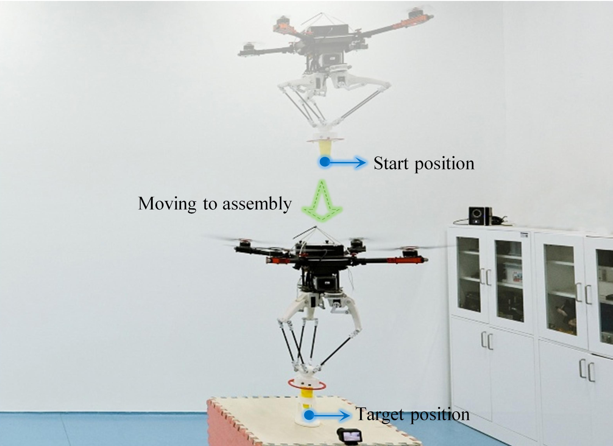

因此，高精度、高可靠性的控制方法是空中机械臂落地应用的核心前提。

## 技术瓶颈

这样的机械系统，现有的控制方案主要分为两类，且这两类都存在难以解决的瓶颈问题：

### 底层动力学控制

通过系统整体的模型，设计控制律来控制四旋翼电机或者机械臂关节的力矩输出，改变加速度这一动力学参数，从而实现运动控制，可分为耦合控制和解耦控制。

但是这样的控制，针对的是加速度这样一个运动学的二阶微分项。位置上出现的误差，经过两次微分，所带来的影响已经被大幅削弱了，所以对于可能出现的干扰并不敏感。如若出现模型参数不准确、有气流干扰无人机旋翼、无人机与机械臂并未固连等问题，以加速度作为控制输入的系统，就很难减小误差，从而无法实现毫米级的控制精度，难以达到精密装配的需求。

### 运动学控制

从系统运动学关系出发，通过协调无人机基座和机械臂的运动，实现末端执行器的高精度控制，是当前高精度空中作业的主流方案。

但是现有的方法存在两大痛点。首先是控制架构的固有矛盾，如果是**解耦控制**，需要先“无人机定位”，再“机械臂操作”，串行的流程，响应较慢，无法动态跟踪；如果是**耦合控制**，通过{{note:notes/Jacobian_Matrix|雅可比矩阵}}实现协同控制，响应更快，但是控制系统的复杂程度大幅提升，而且容易达到奇异点，从而违反物理约束（比如机械臂关节角度的限制）。

其次是反馈策略的核心缺陷。主流的{{note:notes/CLIK|闭环逆运动学(Closed-Loop Inverse Kinematics, CLIK)}}和基于跟踪误差的{{note:notes/MPC|模型预测控制(Model Predictive Control, MPC)}}，仅能实现渐进收敛，无法严格保证末端执行器能在预设的时间内到达目标位置，也无法对跟踪误差进行全时段约束，因此在有严格时序和精度要求的工业场景中存在任务失败的风险。

除此二者之外，控制律也会出现**奇异性**，容易造成输入发散，引发系统失稳甚至安全事故，无法应用于较高安全性要求的场景中。

## 核心创新点

因此，本文将针对以上瓶颈，设计一套**能严格保证预设时间内收敛、全时段跟踪误差约束、无奇异性、满足硬件物理约束**的空中机械臂运动学跟踪控制框架，同时保证算法的机载实时性和工程实用性，最终实现空中精密作业的毫米级精度控制。创新点包括以下几点：

- **能保证预设性能的双层运动学控制架构**：首次提出了**上层预设轨迹跟踪控制 + 下层 QP 参考分配**的双层控制架构，实现了两大核心突破：其一是从理论上严格保证了空中机械臂末端能在用户自定义的预设时间内收敛到目标位置，填补了现有方法无法保证任务完成时间的空白。其二是将系统硬件的位置、速度、加速度物理约束显式嵌入到参考分配环节，从根源上避免了系统在约束边界的振荡问题，大幅提升了实际飞行中的安全性和稳定性。

- **任务驱动的性能包络参数化设计方法**：提出了基于任务核心指标的性能包络边界生成方法，建立了**任务指标 → 性能包络参数**的显式映射关系，其中任务指标包括：初始跟踪误差、稳态跟踪精度要求、任务要求的收敛时间。研究人员可根据实际作业场景的需求，灵活定制性能包络的关键参数，实现了 “任务需求 - 控制性能” 的直接匹配，具备极强的工程适配性。

- **无奇异性的预设误差轨迹跟踪控制方法**：摒弃了传统基于障碍函数的预设性能控制框架，采用预设跟踪误差轨迹对末端跟踪误差进行约束。如此，从数学结构上根本消除了控制律奇异性发生的可能性，彻底避免了边界条件下控制输入发散的安全风险。并且，通过引理和李雅普诺夫稳定性定理，严格证明了跟踪误差始终严格约束在性能包络内，闭环系统全局一致有界稳定。

- **低复杂度的 QP 参考分配策略**：针对机载嵌入式设备的算力限制，设计了低复杂度的二次规划(QP)参考分配方法：通过约束近似，将原本包含位置、速度、加速度的 18 维优化问题（$x-y-z$ 平动方向和 $\alpha-\beta-\gamma$ 转动方向），降维为仅包含速度的 6 维优化问题，大幅降低了计算量，满足机载实时运行要求。采用 OSQP 高效求解器，结合上一时刻解的热启动策略，进一步加速求解过程。支持通过硬约束 / 软代价函数实现多任务优先级的冗余度管理，可拓展到复杂多任务场景。

# 系统建模

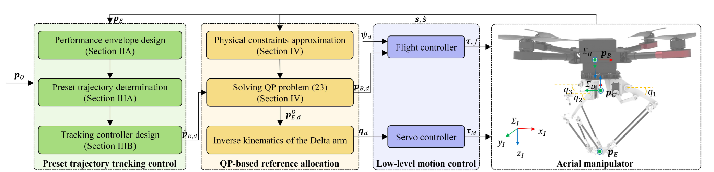

## 坐标系与符号定义

本文研究的空中机械臂由四旋翼无人机基座 + Delta 并联机械臂组成，定义了三个核心参考坐标系：

- **惯性坐标系 $\Sigma_{I}$**：世界固定坐标系，z 轴与重力矢量方向重合，用于描述系统的绝对位置。
- **四旋翼机体坐标系 $\Sigma_{B}$**：与四旋翼基座刚性固连，原点与四旋翼重心重合，用于描述基座的位姿。
- **Delta 机械臂坐标系 $\Sigma_{D}$**：与 Delta 机械臂基座刚性固连，原点为 Delta 机械臂基座的几何中心 $p_C$​，用于描述机械臂末端的相对位置。

## 空中机械臂运动学建模

### 末端执行器全局位置运动学

末端执行器在惯性坐标系下的位置，由四旋翼基座的位姿和机械臂的相对位置共同决定，核心运动学方程为：

$$
p_E = p_B + R_B p^B_E
$$

其中，$p^B_E$ 为机械臂末端在四旋翼机体坐标系下的位置，可通过 Delta 机械臂的正运动学求解得到。

### Delta 机械臂相对运动学

Delta 臂末端在机体坐标系下的位置，可通过机械臂坐标系的变换关系得到：

$$
p^B_E = R^B_D p^D_E + p^B_C
$$

式中，

- $R^B_D \in SO(3)$ 为 Delta 机械臂坐标系 $\Sigma_{D}$ 到 四旋翼机体坐标系 $\Sigma_{B}$ 的旋转矩阵。
- $p^B_C \in \mathbb{R}^3$ 为 Delta 机械臂基座几何中心在四旋翼机体坐标系下的位置。
- $p^D_E \in \mathbb{R}^3$ 为末端执行器在 Delta 机械臂坐标系下的位置，是关节角矢量 $q$ 的函数，即 $p^D_E = f_{kin}(q)$，具体的运动学可以参考《机器人学导论》的相关描述，也可以参考 {{note:notes/Delta_Kinematics|Delta 机械臂的运动学模型解算}}。（Delta 机械臂的逆运动学解算，算是个很有意思的平面几何与向量几何问题。与串联机械臂不同，Delta 机械臂的正运动学难解，需要通过数值方法求解。）

由于驱动本文所使用的 Delta 机械臂的结构为曲柄摇杆机构，因此需要通过平面四杆机构的特性，计算出曲柄转角（即电机转角）和摇杆转角（即关节转角）的关系，具体的计算过程可以参考《机械原理》或者《机械设计基础》等相关教材，在此不多做赘述。

# 预设轨迹跟踪控制

该模块的核心目标是：设计末端期望速度控制律，保证跟踪误差 $e_E$​ 全程严格处于性能包络内，且在预设时间内收敛到稳态精度要求范围内。分为三个核心步骤：

## 性能包络设计

想要做到跟踪误差严格落在设定的误差范围内，那就不得不提到{{note:notes/Prespecified-performance-control|预设性能控制}}，可以直接对一些响应指标进行约束。只不过和其他相关研究（针对障碍函数设计预设性能控制）不同，本文的预设性能控制主要针对的是**末端跟踪误差**这一核心指标。

性能包络是描述末端跟踪误差最大允许边界的时变函数，用于量化任务对控制性能的要求（也就是在控制理论中学到的时域响应图上画一簇图线，用来划定跟踪误差允许的范围）。本文采用**指数形式的边界函数**，保证跟踪误差的绝对值单调递减，其笛卡尔分量形式为：

$$
\rho_{\nu}(t) = (\rho_{\nu,0} - \rho_{\nu,\infty}) e^{-l_Et} + \rho_{\nu,\infty} \in \mathbb{R}, \quad \nu \in \{x, y, z\}
$$

式中三个核心参数的物理意义与整定规则如下：

- 初始边界 $\rho_{\nu,0}$：性能包络的初始值，需满足 $\rho_{\nu,0} > \lvert e_{E,\nu}(0) \rvert$，即初始边界必须大于初始跟踪误差，由任务的初始位置偏差确定。
- 稳态边界 $\rho_{\nu,\infty}$：性能包络的稳态值，代表任务允许的最大稳态跟踪误差，其下限由机械臂末端的硬件精度决定，上限由任务的操作精度要求决定。
- 衰减率 $l_E$：性能包络的指数衰减速率，直接决定了跟踪误差的收敛速度，由用户设定的预设收敛时间 $t_p$​ 决定，整定分为两步：
    - 定义容差阈值 $\epsilon_p \in \mathbb{R}$，满足：
    $$
    \epsilon_p = (\lVert \rho_{0} \rVert - \lVert \rho_{\infty} \rVert)e^{-l_Et_p}
    $$
    通常取 ${\epsilon}_p = 0.1\lVert \rho_{\infty} \rVert$​，代表预设时间 $t_p$ 时刻，包络边界与稳态值的允许偏差。
    - 根据容差阈值的定义式，反解得到衰减率 $l_E = \dfrac{\ln\!\left(\dfrac{\lVert \rho_{0} \rVert - \lVert \rho_{\infty} \rVert}{\epsilon_p}\right)}{t_p}$，其中预设时间 $t_p$ 是用户自定义的任务完成时间，受限于末端执行器的最大运动速度。

## 预设跟踪误差轨迹设计

通过设计一条单调递减的预设跟踪误差轨迹 $\alpha(t)$，对其跟踪误差进行约束。借助后续部分设计的跟踪控制律，可以强行将跟踪误差控制在性能包络内。如图3所示。

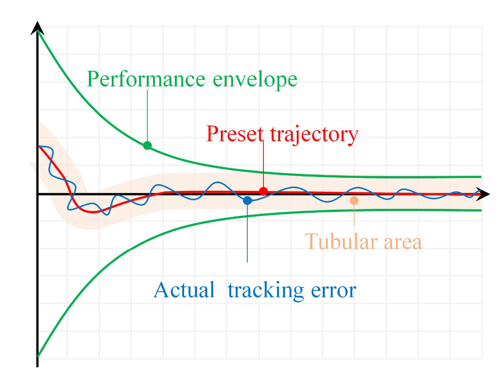

### 预设轨迹的微分方程与解析解

预设轨迹的笛卡尔分量满足如下的一阶线性微分方程：

$$
\dot{\alpha}_\nu(t) = -l_E \alpha_\nu(t) + b_\nu e^{-(l_E + c_\nu)t}, \quad \alpha_\nu(0) = e_{E,\nu}(0)
$$

式中：

- $b_\nu = l_E e_{E,\nu}(0) + \dot{e}_{E,\nu}(0)$，由初始跟踪误差和初始误差变化率决定。
- $c_\nu > 0$ 为可设计的正参数（后续将给出设计准则），决定了预设轨迹的收敛速度。

该微分方程的解析解为：

$$
\alpha_\nu(t) = \frac{b_\nu}{c_\nu}(1 - e^{-c_\nu t})e^{-l_E t} + e_{E,\nu}(0)e^{-l_E t}
$$

从而得到：

$$
\alpha_\nu(0) = e_{E,\nu}(0), \quad \alpha_\nu(\infty) = 0
$$

其一阶和二阶导数分别为：

$$
\dot{\alpha}_\nu(t) = \frac{b_\nu}{c_\nu}[- l_E e^{-l_E t} + (c_\nu + l_E) e^{-(c_\nu + l_E) t}] - e_{E,\nu}(0)l_E e^{-l_E t}
$$

$$
\ddot{\alpha}_\nu(t) = \frac{b_\nu}{c_\nu}[l_E^2 e^{-l_E t} - (c_\nu + l_E)^2 e^{-(c_\nu + l_E) t}] + e_{E,\nu}(0)l_E^2 e^{-l_E t}
$$

### 轨迹约束的严格证明（引理 1）

现在，$\alpha_\nu(t)$ 仅剩 $c_\nu$ 尚未确定。接下来给出一个引理，为 $c_\nu$ 设计整定准则。

**引理 1**：设 $\epsilon_\nu$ 为正常数，满足：

$$
\epsilon_\nu < \min\{\rho_{\nu,\infty}, \rho_{\nu,0} - \lvert e_{E,\nu}(0) \rvert\}
$$

对于计算后的预设轨迹 $\alpha_\nu(t)$，若参数 $c_\nu$ 满足：

$$
c_\nu > \frac{b_\nu}{\rho_\nu - \epsilon_\nu - \lvert e_{E,\nu}(0) \rvert}
$$

则对于所有的 $t \geq 0$，有：

$$
\lvert \alpha_\nu(t) \rvert < \rho_\nu(t) - \epsilon_\nu
$$

证明过程{{note:notes/Lemma_1|见此处}}，一个很有趣的指数放缩证明。

引理 1 给出了一个可以确定矢参量 $c$ 的方法，通过整定 $c$，让预设轨迹的收敛速度快于性能包络边界的衰减速度，从而从根源上保证轨迹不会触碰包络边界，为后续实际跟踪误差的约束提供了安全区间。

## 跟踪控制律设计

对于空中机械臂这种{{note:notes/nonlinearity|非线性度较高的系统}}，如果需要达到消除末端跟踪的稳态误差的效果，需要引入积分项。

很多人可能第一时间想到的是 PID，但是 PID 在设计前需要对非线性系统进行线性化近似，容易引入新的误差项。不仅如此，传统 PID 对于抗干扰的能力也较弱，参数整定也比较复杂。

当然，也有不需要引入积分项的控制方法，比如带有 learning-based 意味的 MPC、强化学习等方法，但是这些方法计算量太大，机载电脑难以承受如此巨额的算力，而且控制系统的鲁棒性严重依赖模型精度。

所以，既能满足引入积分项、消除稳态误差的要求，又适合非线性系统、算力需求小、控制鲁棒性好，那么{{note:notes/slide_mode_control|滑模控制}}就成为了一个不错的选择。

### 滑模变量与控制律设计

定义跟踪误差与预设轨迹的偏差：

$$
z = e_E - \alpha(t)
$$

设计带积分项的滑模控制律：

$$
s = z + \Lambda \int_{0}^{t} z d\tau
$$

其中 $\Lambda$ 为正定对角增益矩阵。对滑模矢量求导可得：

$$
\dot{s} = \dot{z} + \Lambda z = \dot{p_E} - \dot{p_O} - \dot{\alpha} + \Lambda z
$$

考虑到系统可能出现的不确定性，末端实际速度与期望速度满足：

$$
\dot{p}_E = \dot{p}_{E,d} + \Delta
$$

其中，$\Delta$ 为系统未建模动态、扰动等带来的未知有界项，满足 $\lVert \Delta \rVert \leq \delta_E$。

从而得到：

$$
\dot{s} = \dot{p}_{E,d} + \Delta - \dot{p}_O - \dot{\alpha} + \Lambda z
$$

为了使滑模变量 $s$ 收敛到 0，根据滑模控制理论，设计 $\dot{s} = -Ks$ ，最终设计的末端期望速度控制律为：

$$
\dot{p}_E = \dot{p_O} + \dot{\alpha} - \Lambda z - Ks
$$

其中，$K$ 为正定对角控制增益矩阵。

### 闭环稳定性与误差约束证明（定理 1）

控制系统的有效性可以通过以下定理 1 来严格证明。

**定理 1**：假设不确定性参数 $\Delta$ 有界，即 $\lVert \Delta \rVert \leq \delta_E$，若跟踪控制律采用 $\dot{p}_E = \dot{p_O} + \dot{\alpha} - \Lambda z - Ks$ 的形式，那么跟踪的位置误差 $e_E$ 有界，且 $\lVert e_{E,\nu} \rVert < \rho_{\nu}(t), \forall t \geq 0$。

证明过程{{note:notes/Theorem_1|见此处}}。有点意思，和上面的引理 1类似，基本上都是指数放缩，然后带点三角不等式放缩。果然控制的尽头是数学。

# 参考量分配

这部分来解决一下通过上述控制系统得到的速度指令 $\dot{p}_{E,d}$ 如何分配给四旋翼和机械臂的问题，同时严格满足系统的物理约束，保证控制指令的可执行性。

## 优化问题的构建
将参考量（速度指令）分配问题转化为一个带约束的 **二次规划(QP)** 问题，其核心是在满足物理约束的前提下，让末端实际速度尽可能跟踪期望速度，同时保证控制量的平滑性。

设置 $s = [p_B^T, p_E^{D,T}]^T$ 为空中机械臂的状态矢量，其由四旋翼基座在惯性系 $\Sigma_I$ 中的位置、以及末端执行器在 Delta 机械臂坐标系 $\Sigma_D$ 中的位置构成。末端执行器位置 $p_E$ 的时间导数为：

$$
\dot{p}_E = J \dot{s} - [R_B p_E^B]\times \omega
$$

其中 $J = [I_3, R_B R_D^B]$ 为系统雅可比矩阵，$I_3$ 为 3×3 单位矩阵。

QP 问题的代价函数设计为两项之和：

$$
\min_{\dot{s}} F(\dot{s}) = (\dot{p}_E - \dot{p}_{E,d})^T (\dot{p}_E - \dot{p}_{E,d}) + \dot{s}^T W\dot{s}
$$

式中：

- 跟踪误差项：最小化末端实际速度与期望速度的偏差，保证跟踪性能。
- 控制量正则项：$W$ 为正定对角权重矩阵，用于惩罚过大的控制输入，保证基座和机械臂运动的平滑性，避免剧烈机动。
- 代入微分运动学关系，可将代价函数转化为标准二次型形式：

$$
F(\dot{s}) = \dot{s}^T(J^T J + W)\dot{s} - 2(\dot{p}_E + [R_B p_E^B]\times \omega)^T J \dot{s}
$$

$$
s.t. \quad \dot{s}_{\underline{p}} \leq \dot{s} \leq \dot{s}_{\overline{p}}, \quad \dot{s}_{min} \leq \dot{s} \leq \dot{s}_{max}, \quad \dot{s}_{\underline{v}} \leq \dot{s} \leq \dot{s}_{\overline{v}}
$$

三类约束的物理意义如下：

- 位置约束近似 $\dot{s}_{\underline{p}} / \dot{s}_{\overline{p}}$ ：将基座和机械臂的位置硬约束，近似为对速度的约束，避免运动超出硬件行程范围。
- 速度硬约束 $\dot{s}_{min} / \dot{s}_{max}$ ：基座和机械臂的最大 / 最小运动速度限制，由电机和驱动器的硬件性能决定。
- 加速度约束近似 $\dot{s}_{\underline{v}} / \dot{s}_{\overline{v}}$ ：将系统的加速度硬约束，近似为对速度的约束，避免运动加速度超出硬件极限，保证飞行稳定性。

## 工程实现与优化

### 计算复杂度降维

若直接对位置、速度、加速度分别建模，QP 问题将包含 18 个优化变量，对机载嵌入式设备的算力要求极高。本文通过约束近似，将所有约束均转化为对速度 $\dot{s}$ 的约束，优化变量从 18 维降至 6 维，计算量大幅降低，完全满足机载实时运行要求。

### 高效求解与加速
本文采用 {{note:notes/OSQP|OSQP（Operator Splitting Quadratic Program） 求解器}}求解 QP 问题（需要具备一定的凸优化基础），该求解器是专为嵌入式场景设计的高效 QP 求解器，具备内存占用小、求解速度快的特点。同时，采用**热启动策略**，将上一控制周期的求解结果作为当前周期的迭代初值，进一步大幅缩短求解时间。

### 多任务冗余度管理

该 QP 框架支持多任务优先级的冗余度管理：

- 硬优先级：通过添加等式 / 不等式约束，强制高优先级任务优先满足。
- 软优先级：通过在代价函数中添加不同权重的任务项，实现多任务的加权优化。

该特性让算法可拓展到复杂的多任务空中作业场景。

# 实验验证

## 通用实验设置

### 硬件平台

- 四旋翼基座：轴距 0.65m，含电池总质量 3.60kg，采用 Pixhawk 4 飞控，底层运行基于 ESO 的非线性飞行控制器。
- Delta 机械臂：基座质量 0.56kg，运动臂质量 0.44kg，3 自由度平动并联机构。
- 机载计算机：Intel NUC i7，运行 ROS 系统，部署本文提出的跟踪控制器、Delta 臂逆运动学和 QP 求解器。
- 测量系统：Vicon 光学动捕系统，提供亚毫米级的基座和末端位置测量，作为位置反馈。设置的测量点位如图4所示。

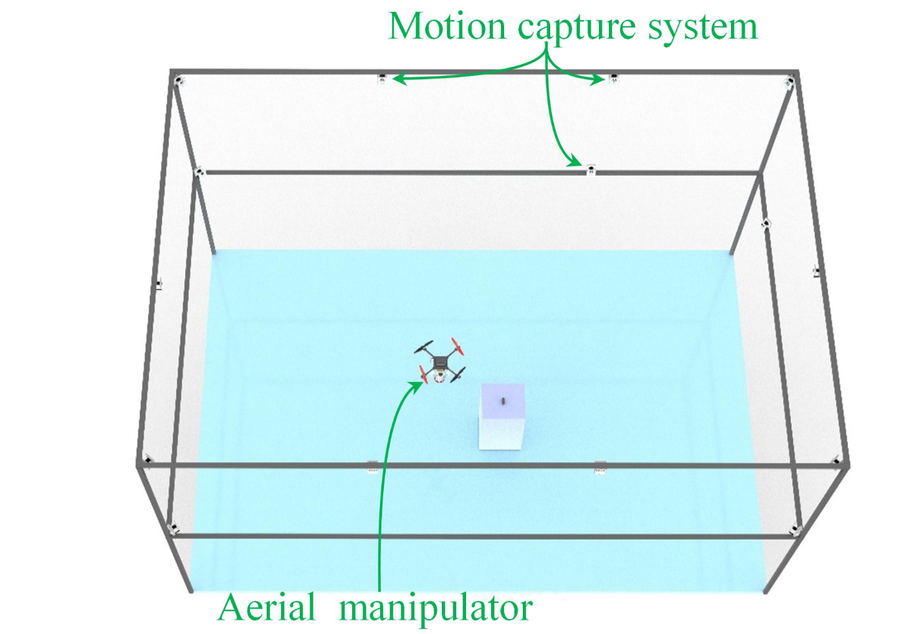

### 通用控制参数

- 滑模积分增益 $\Lambda = diag[0.2, 0.2, 0.2]$
- 控制增益 $K = diag[1.2, 1.2, 1.2]$
- 不确定性上界 $\Delta p_E = 0.01$
- 稳态性能包络边界 $\rho_{\infty} = [0.02, 0.02, 0.02]$ （单位：米）

### 对照组设置

本文选取了领域内两种主流方法作为对照组，保证对比的公平性：
- CLIK 方法：采用经典的闭环逆运动学反馈策略，结合本文提出的 QP 参考分配模块，控制参数经过最优整定。
- 误差基方法：直接基于末端跟踪误差的 MPC 方法，是当前空中机械臂运动学控制的主流先进方法。

## 实验 1：静态点跟踪（算法性能对标）

控制末端执行器从起始位置 $[0, 0, −2.1]$ 运动到目标位置 $[1, −1, −1.5]$，使用 Gazebo 11 作为仿真平台，加入真实传感器噪声（GPS 噪声、陀螺仪噪声、加速度计噪声，均为零均值高斯噪声）。设置参数 $\rho_0 = [2.0, 2.0, 1.2], \quad c = [0.25, 0.25, 0.25]$，然后将每种方法开展 21 组重复实验，取中位数结果进行对比，避免随机误差影响。实验图示如图5(a)所示。

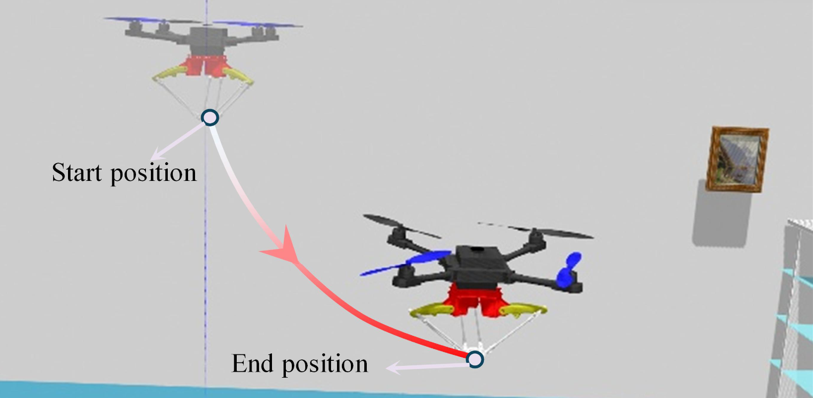

三种方法所行轨迹如图5(b)所示。

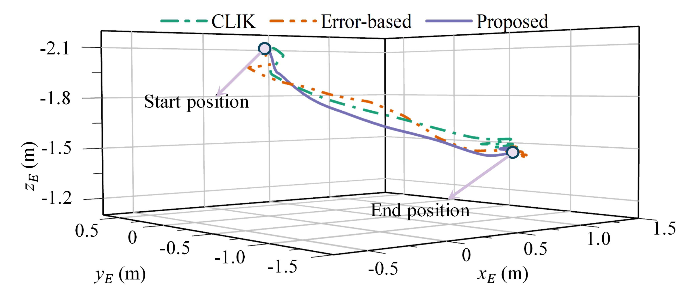

经过实验，三种方法的性能对比如下表所示（图线如图5(c)所示）：

|性能指标|本文方法|CLIK 方法|误差基方法|本文方法提升幅度|
|:-:|:-:|:-:|:-:|:-:|
|平均跟踪误差中位数|$10.31 cm$|$12.66 cm$|$11.55 cm$|较 CLIK 降低 22.8%，较误差基降低 12.0%|
|跟踪误差标准差|$0.45 cm$|$0.75 cm$|$0.52 cm$|鲁棒性显著提升|
|收敛时间中位数|$2.4 s$|$4.8 s$|$3.2 s$|较 CLIK 缩短 50%，较误差基缩短 25%|

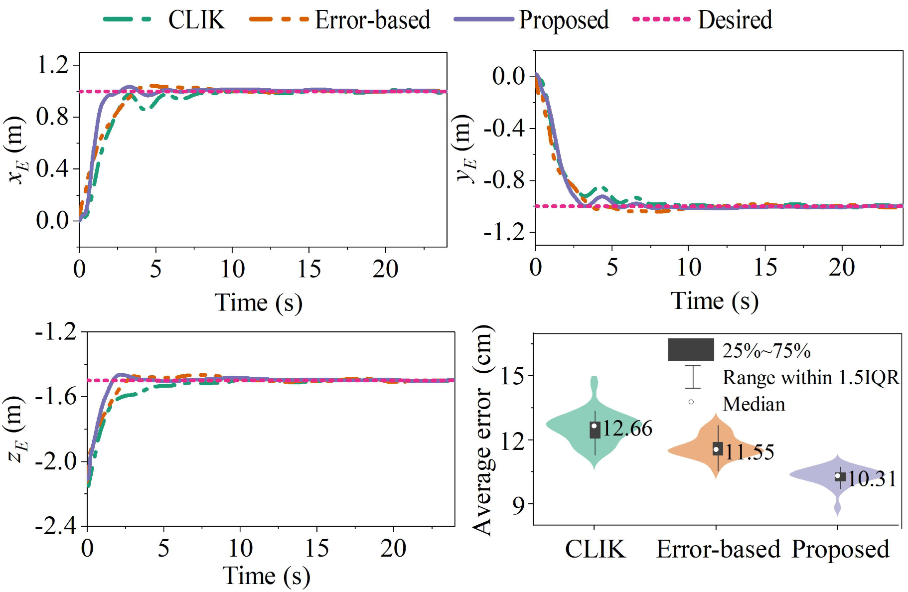

此外，本文设置了 5s、10s、15s、20s 四组不同的预设时间，开展 21 组重复实验，如图5(d)所示。

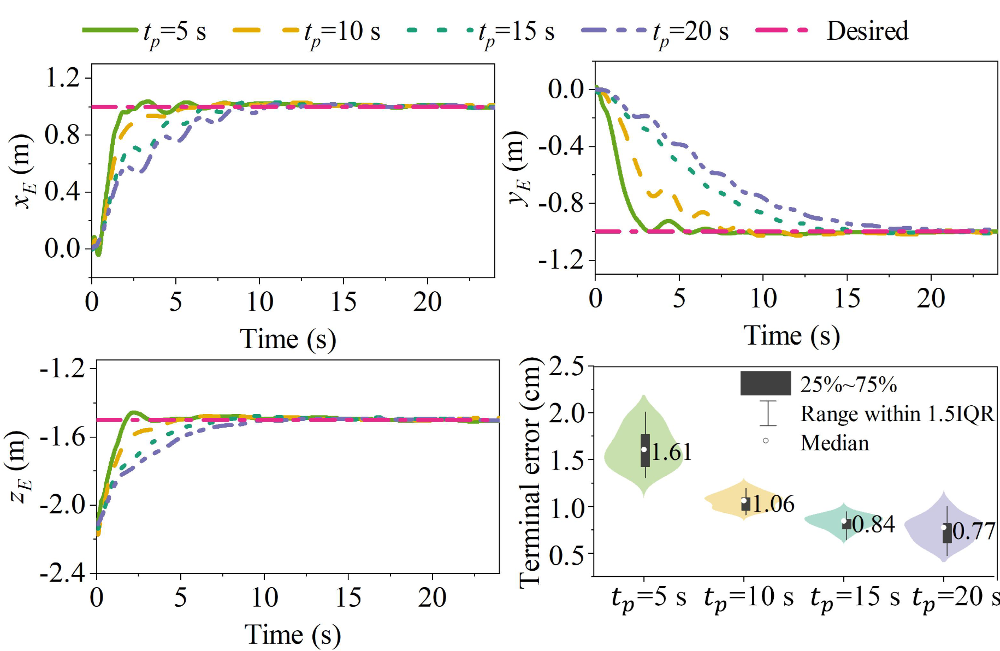

核心结论为：

- 预设时间 $t_p$​ 从 5s 增加到 20s 时，末端跟踪误差从 1.61cm 降低到 0.77cm。
- 验证了用户可通过调整预设时间，在 “任务完成速度” 和 “末端跟踪精度” 之间进行灵活权衡，完全匹配不同任务的需求。

## 实验 2：空中抓取（场景实用性验证）

抓取固定在立柱上的目标物体，末端安装刚性两指夹爪，如图6(a)所示。预设时间 $t_p = 10s, \quad \rho_0 = [0.1, 5.0, 3.0], \quad c = [0.15, 0.15, 0.15]$。设置末端起始位置为 $[0.01, 0.99, −2.42]$，目标位置为 $[0, −1.36, −1.34]$。实验图示如图6(b)所示。

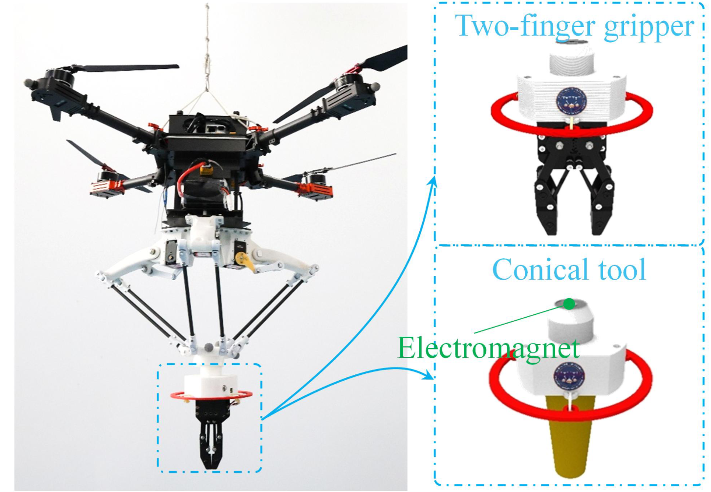

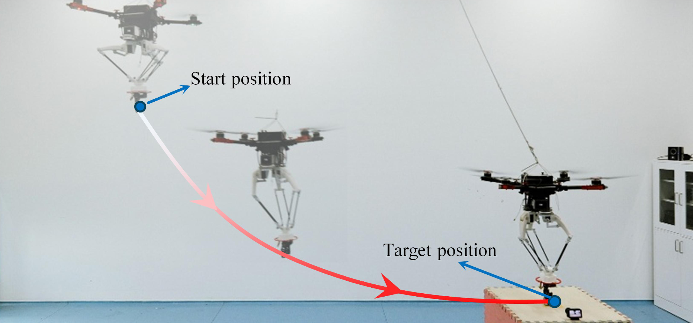

所行轨迹如图6(c)所示。

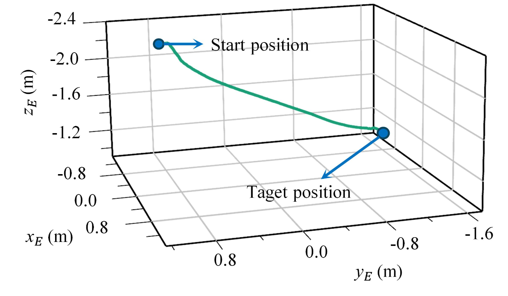

实验结果如图6(d)和6(e)所示。结果表明：
- 末端跟踪误差在 x/y/z 三个方向上，全程严格处于预设的性能包络内，无超调、无边界触碰。
- 终端跟踪误差为 1.26cm，标准差 0.81cm，满足抓取任务的精度要求。
- 总任务完成时间 11.8s，与预设的 10s 收敛时间高度匹配，验证了算法对任务完成时间的严格保证。

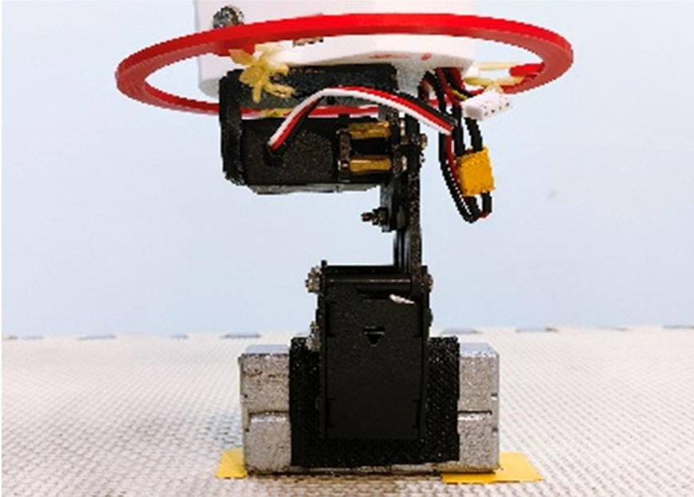

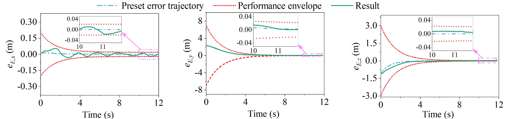

## 实验 3：轴孔装配（精密作业能力验证）

将锥形工具通过电磁铁吸附在末端，完成向安装位点的轴孔插入装配，装配过程如图7(a)和7(b)所示。预设时间 $ t_p = 5s, \quad \rho_0 = [0.1, 0.1, 2.0], \quad c = [0.3, 0.3, 0.3]$。设置末端起始位置为 $[0.04, −1.47, −2.40]$，安装位点为 $[0.04, −1.37, −1.34]$。通过 16 次重复实验，统计任务完成时间和终端跟踪误差。

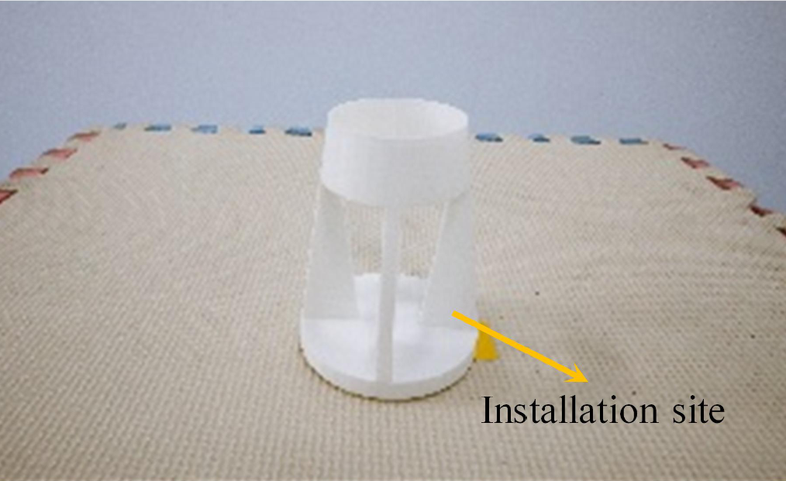

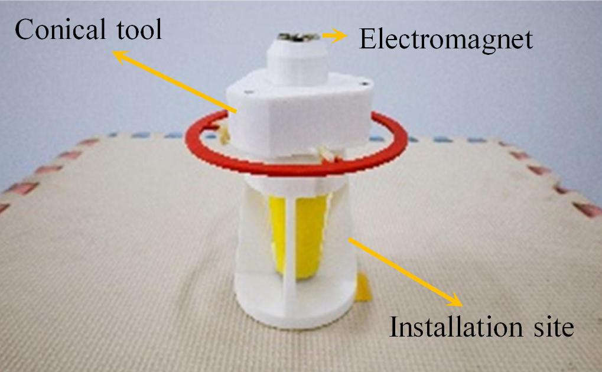

所行轨迹如图7(c)所示。

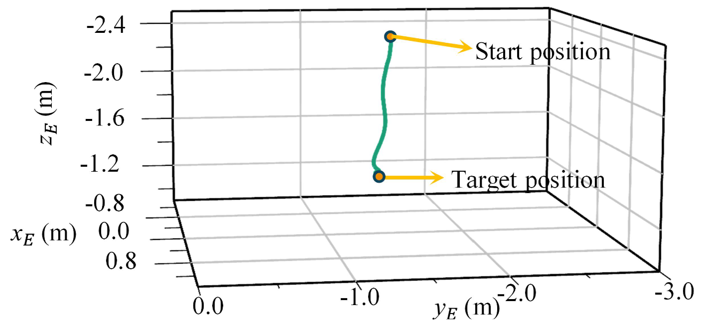

实验结果如图7(d)所示。结果表明：

- 16 次实验全部成功完成轴孔装配，任务完成时间 6.2~6.8s，平均 6.5s，与预设的 5s 收敛时间高度匹配。
- 三个方向的平均终端跟踪误差：x 方向 0.28cm，y 方向 0.46cm，z 方向 0.54cm，整体平均终端跟踪误差 0.89cm，标准差为 0.64cm，**实现了亚厘米级的毫米级操作精度**。
- 验证了算法在工业级精密空中作业场景中的落地潜力，突破了传统方法无法同时保证时序和精度的瓶颈。

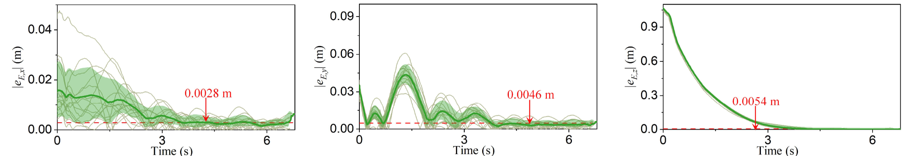

# 结论

本文提出一种新型运动学跟踪控制方法，该方法由**预设轨迹跟踪控制**与**基于二次规划的参考量分配**两部分构成，并通过三组实验验证了所提方法的性能。

在静态点跟踪实验中，对比结果表明，与闭环逆运动学方法相比，所提方法的平均跟踪误差降低 22.8%；与基于误差的控制方法相比，平均跟踪误差降低 12.0%。研究还发现，调整预设时间 $t_p$ 可有效减小末端执行器的终端跟踪误差。

空中抓取与轴孔装配任务的实验结果均表明，所提算法能够有效应用于实际的空中操作场景。

未来的研究可围绕以下方向展开：

- 采用扰动估计方法对扰动 $\Delta$ 进行估计，以提升系统对动态耦合与风扰的鲁棒性。
- 实现冗余度管理策略，增强系统的任务完成能力。

# 参考文献

1. Ollero A, Tognon M, Suarez A, et al. Past, present, and future of aerial robotic manipulators[J]. IEEE Transactions on Robotics, 2021, 38(1): 626-645.
2. Ding X, Guo P, Xu K, et al. A review of aerial manipulation of small-scale rotorcraft unmanned robotic systems[J]. Chinese Journal of Aeronautics, 2019, 32(1): 203-217.
3. Ruggiero F, Lippiello V, Ollero A. Aerial manipulation: A literature review[J]. IEEE Robotics and Automation Letters, 2018, 3(3): 1957-1964.
4. Luo W, Chen J, Ebel H, et al. Time-optimal handover trajectory planning for aerial manipulators based on discrete mechanics and complementarity constraints[J]. IEEE Transactions on Robotics, 2023, 39(6): 4332-4349.
5. Cao H, Shen J, Liu C, et al. Motion planning for aerial pick-and-place with geometric feasibility constraints[J]. IEEE Transactions on Automation Science and Engineering, 2025, 22(1): 2577-2594.
6. Bodie K, Brunner M, Pantic M, et al. Active interaction force control for contact-based inspection with a fully actuated aerial vehicle[J]. IEEE Transactions on Robotics, 2020, 37(3): 709-722.
7. Wang M, Chen Z, Guo K, et al. Millimeter-level pick and peg-in-hole task achieved by aerial manipulator[J]. IEEE Transactions on Robotics, 2023.
8. Fumagalli M, Naldi R, Macchelli A, et al. Developing an aerial manipulator prototype: Physical interaction with the environment[J]. IEEE Robotics & Automation Magazine, 2014, 21(3): 41-50.
9. Cao H, Li Y, Liu C, et al. ESO-based robust and high-precision tracking control for aerial manipulation[J]. IEEE Transactions on Automation Science and Engineering, 2023, 21(2): 2139-2155.
10. Welde J, Paulos J, Kumar V. Dynamically feasible task space planning for underactuated aerial manipulators[J]. IEEE Robotics and Automation Letters, 2021, 6(2): 3232-3239.
11. Chermprayong P, Zhang K, Xiao F, et al. An integrated Delta manipulator for aerial repair: A new aerial robotic system[J]. IEEE Robotics & Automation Magazine, 2019, 26(1): 54-66.
12. Chiacchio P, Chiaverini S, Sciavicco L, et al. Closed-loop inverse kinematics schemes for constrained redundant manipulators with task space augmentation and task priority strategy[J]. The International Journal of Robotics Research, 1991, 10(4): 410-425.
13. Muscio G, Pierri F, Trujillo M A, et al. Coordinated control of aerial robotic manipulators: theory and experiments[J]. IEEE Transactions on Control Systems Technology, 2017, 26(4): 1406-1413.
14. Shi W, Hou M, Duan G. A preset-trajectory-based singularity-free preassigned performance control approach[J]. IEEE Transactions on Automatic Control, 2024, 69(9): 6183-6190.
15. Chen Y, Lan L, Liu X, et al. Adaptive stiffness visual servoing for unmanned aerial manipulators with prescribed performance[J]. IEEE Transactions on Industrial Electronics, 2024, 71(9): 11028-11038.
16. Shi W, Keliris C, Hou M, et al. Preset-trajectory-based tracking control of a class of mismatched uncertain systems[J]. IEEE Transactions on Automatic Control, 2025, 70(1): 526-533.
17. López M, Castillo E, García G, et al. Delta robot: inverse, direct, and intermediate Jacobians[J]. Proceedings of the Institution of Mechanical Engineers, Part C: Journal of Mechanical Engineering Science, 2006, 220(1): 103-109.
18. Stellato B, Banjac G, Goulart P, et al. OSQP: an operator splitting solver for quadratic programs[J]. Mathematical Programming Computation, 2020, 12(4): 637-672.
19. Baizid K, Giglio G, Pierri F, et al. Behavioral control of unmanned aerial vehicle manipulator systems[J]. Autonomous Robots, 2017, 41(5): 1203-1220.
20. Lee J, Balachandran A, Kondak K, et al. Virtual reality via object pose estimation and active learning: Realizing telepresence robots with aerial manipulation capabilities[J]. Field Robotics, 2023, 3: 323-367.
21. Guo X, He G, Mousaei M, et al. Aerial interaction with tactile sensing[C]. 2024 IEEE International Conference on Robotics and Automation (ICRA), 2024: 1576-1582.
22. Yang H S, Lee D. Dynamics and control of quadrotor with robotic manipulator[C]. 2014 IEEE International Conference on Robotics and Automation (ICRA), 2014: 5544-5549.
23. Sánchez M, Acosta J A, Ollero A. Integral action in first-order closed-loop inverse kinematics. application to aerial manipulators[C]. 2015 IEEE International Conference on Robotics and Automation (ICRA), 2015: 5297-5302.
24. Lunni D, Santamaria-Navarro A, Rossi R, et al. Nonlinear model predictive control for aerial manipulation[C]. 2017 International Conference on Unmanned Aircraft Systems (ICUAS), 2017: 87-93.
25. Lee D, Seo H S, Kim D W, et al. Aerial manipulation using model predictive control for opening a hinged door[C]. 2020 IEEE International Conference on Robotics and Automation (ICRA), 2020: 1237-1242.
26. Cataldi E, Real F, Suárez A, et al. Set-based inverse kinematics control of an anthropomorphic dual arm aerial manipulator[C]. 2019 IEEE International Conference on Robotics and Automation (ICRA), 2019: 2960-2966.
27. Sciavicco L, Villani L, Siciliano B, et al. Robotics: modelling, planning and control[M]. Springer, 2010.
28. Shigley J E, Mischke C R, Brown T H. Standard handbook of machine design[M]. McGraw-Hill Education, 2004.
29. Khalil H K. Nonlinear systems[M]. 3rd ed. Prentice Hall, 2002.
30. Zhao S. Mathematical Foundations of Reinforcement Learning[M]. Springer Nature Press, 2025.
